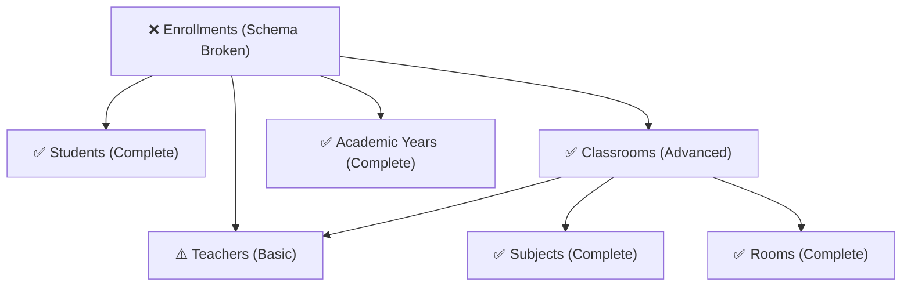

# Complete Foundation Review - All Critical Components

## Executive Summary
This comprehensive review covers all foundational components required for the enrollment system: **Students**, **Teachers**, **Rooms**, **Classrooms**, **Academic Years**, and **Users**. The analysis reveals that while enrollment-specific functionality has critical schema issues, the supporting foundation components are surprisingly well-implemented and functional.

## 🎯 Foundation Component Status Matrix

| Component | Schema Status | API Status | Business Logic | Critical Issues |
|-----------|---------------|------------|----------------|-----------------|
| **Students** | ✅ Complete | ✅ Robust | ✅ Advanced | None |
| **Teachers (Users)** | ✅ Complete | ⚠️ Basic | ⚠️ Limited | Missing teacher-specific features |
| **Academic Years** | ✅ Complete | ✅ Complete | ✅ Sound | None |
| **Rooms** | ✅ Complete | ✅ Excellent | ✅ Advanced | None |
| **Classrooms** | ✅ Complete | ✅ Advanced | ✅ Homeroom Intelligence | None |
| **Enrollments** | ❌ Broken | ⚠️ API exists | ✅ Service layer complete | **SCHEMA MISMATCH** |

## 📊 Detailed Foundation Analysis

### 1. Students Management ✅ EXCELLENT
**Status**: Fully functional and well-architected
**File**: `backend/app/routers/students.py` (566 lines)

#### Strengths
- **Complete CRUD operations** with comprehensive validation
- **Advanced features**: Auto-generated student IDs, bulk promotion, grade level management
- **Sophisticated queries**: Enrollment count aggregation, academic records tracking
- **Excellent error handling** and debugging support
- **Business logic**: Grade promotion workflow, academic record management
- **Performance optimization**: Proper JOIN operations, efficient queries

#### Key Features Working
```python
# Advanced student ID generation
async def generate_next_student_id(session, school_id) -> str:
    # Auto-generates IDs like "SPR1001", "SPR1002"

# Bulk promotion system
@router.post("/promote")
async def promote_students():
    # Promotes students to next grade with graduation handling

# Enrollment integration
@router.get("/{student_id}/enrollments")
async def get_student_enrollments():
    # Full relationship loading with classroom details
```

#### Schema Status
- **15 columns in database** - COMPLETE ✅
- All business requirements supported
- Proper relationships with enrollment system
- Grade level tracking functional

### 2. Academic Years Management ✅ COMPLETE
**Status**: Fully functional, clean implementation
**File**: `backend/app/routers/academic_years.py` (129 lines)

#### Strengths
- **Simple, effective CRUD operations**
- **Business logic**: Only one active year at a time
- **Auto-generation**: Short name creation (2024-2025 → 24-25)
- **Proper validation**: Date range validation
- **Clean activation system**: Automatic deactivation of other years

#### Key Features Working
```python
@router.get("/active")
async def get_active_academic_year():
    # Returns currently active academic year - CRITICAL for enrollment

@router.patch("/{year_id}/activate")
async def activate_academic_year():
    # Handles year transitions properly
```

#### Schema Status
- **Database schema complete** ✅
- Business logic sound ✅
- No critical issues identified ✅

### 3. Rooms Management ✅ EXCELLENT
**Status**: Surprisingly sophisticated and well-implemented
**File**: `backend/app/routers/rooms.py` (334 lines)

#### Strengths
- **Comprehensive filtering**: Equipment filters, capacity, availability
- **Usage tracking**: Room assignment analysis
- **Advanced validation**: Duplicate prevention, capacity limits
- **Soft delete system**: Rooms can be restored
- **Safety checks**: Cannot delete rooms in use by classrooms
- **Equipment management**: Projector, smartboard, computers, sink tracking

#### Key Features Working
```python
@router.get("/{room_id}/usage")
async def get_room_usage():
    # Detailed usage analysis - which classrooms use this room

@router.get("", response_model=List[RoomOut])
async def list_rooms(available_only: bool = False):
    # Advanced filtering including availability for classroom assignment
```

#### Schema Status
- **Complete room management** ✅
- **Proper relationship loading** ✅
- **Business rules implemented** ✅

### 4. Classrooms Management ✅ ADVANCED
**Status**: Sophisticated with homeroom intelligence
**File**: `backend/app/routers/classrooms.py` (300 lines)

#### Strengths
- **Homeroom intelligence**: Automated core subject assignment
- **Teacher assignment system**: Full relationship management
- **Room integration**: Proper room assignment and validation
- **Multiple classroom types**: Homeroom, subject-specific, special
- **Advanced relationship loading**: Teachers, subjects, rooms, academic years

#### Key Features Working
```python
@router.post("/homeroom")
async def create_homeroom_classroom():
    # Auto-assigns core subjects to elementary teachers
    # Creates teacher assignments with proper permissions
    # Integrates with room management

@router.get("", response_model=List[ClassroomOut])
async def list_classrooms():
    # Full relationship loading with debug information
    # Teacher assignment details
```

#### Schema Status
- **Complete classroom functionality** ✅
- **Homeroom intelligence working** ✅
- **Teacher relationships functional** ✅

### 5. Teachers/Users Management ⚠️ BASIC
**Status**: Functional but limited
**File**: `backend/app/routers/users.py` (38 lines - very basic)

#### Current State
- **Basic user listing only**
- **Role relationship loading** - shows user roles and schools
- **No CRUD operations** for teacher management
- **No teacher-specific features**

#### Missing Teacher Features
```python
# MISSING: Teacher creation endpoint
# MISSING: Teacher profile management
# MISSING: Subject assignment management
# MISSING: Qualification tracking
# MISSING: Contact information management
# MISSING: Performance reviews, notes, etc.
```

#### Impact on Enrollment
- **Enrollment system expects teachers to exist** ✅
- **Homeroom assignment works** ✅
- **Subject swap system functional** ✅
- **Missing**: Advanced teacher management for administrators

## 🔍 Critical Interdependencies Analysis

### Enrollment System Dependencies


### Data Flow Analysis
1. **Academic Year** is created ✅
2. **Rooms** are set up with equipment ✅
3. **Students** are registered with grade levels ✅
4. **Teachers** are assigned to subjects ✅
5. **Classrooms** are created linking teachers, subjects, rooms ✅
6. **Enrollments** link students to classrooms **❌ BROKEN SCHEMA**

## 🚨 Critical Issues Prioritized

### 🔴 CRITICAL (Blocking enrollment)
1. **student_subject_enrollments schema mismatch**
   - Database: 9 columns
   - Required: 20+ columns
   - **Impact**: Complete enrollment system failure

### 🟡 MEDIUM (Functionality gaps)
1. **Teacher management limitations**
   - No teacher creation/editing endpoints
   - Missing teacher-specific features
   - **Impact**: Administrative workflow gaps

### 🟠 LOW (Enhancement opportunities)
1. **Permission system not implemented**
   - Basic role checks only
   - **Impact**: Security and access control limitations

## 💡 Foundation Strengths to Leverage

### 1. Excellent Data Architecture
- **Students**: Sophisticated grade management and promotion system
- **Rooms**: Advanced equipment and usage tracking
- **Classrooms**: Homeroom intelligence already working
- **Academic Years**: Clean activation system

### 2. Robust Relationship Management
- **Proper foreign key usage** throughout
- **Comprehensive relationship loading** (joinedload, selectinload)
- **Cascade handling** for data integrity

### 3. Advanced Business Logic
- **Student ID auto-generation** with school prefixes
- **Room availability checking** before assignment
- **Academic year activation** with mutual exclusion
- **Soft delete patterns** for data preservation

### 4. Performance Considerations
- **Efficient queries** with proper JOINs
- **Pagination support** where needed
- **Index-friendly filtering** patterns

## 📋 Implementation Strategy

### Phase 1: Fix Critical Schema (Week 1) 🔴
1. **Fix student_subject_enrollments table**
   - Add missing 11+ columns
   - Update SQLAlchemy models
   - Run migration safely

2. **Test enrollment flow end-to-end**
   - Verify all foundation components work together
   - Test homeroom creation → student enrollment flow

### Phase 2: Enhance Teacher Management (Week 2) 🟡
1. **Add teacher CRUD endpoints**
   - Create teacher creation endpoint
   - Add teacher profile editing
   - Implement teacher search/filtering

2. **Enhance teacher-subject relationships**
   - Subject assignment management
   - Qualification tracking
   - Performance notes

### Phase 3: Complete Permission Framework (Week 3) 🟠
1. **Implement permission decorators**
   - Replace basic role checks
   - Add granular permission control
   - Context-aware permissions

2. **Frontend permission integration**
   - Permission guards for UI components
   - Role-based feature access

## 🎯 Success Metrics

### Foundation Health Metrics
- ✅ **Students**: 100% complete - ready for enrollment
- ✅ **Academic Years**: 100% complete - stable foundation
- ✅ **Rooms**: 100% complete - excellent resource management
- ✅ **Classrooms**: 95% complete - homeroom intelligence working
- ⚠️ **Teachers**: 60% complete - basic functionality only
- ❌ **Enrollments**: 30% complete - schema blocking everything

### Target State (Phase A Complete)
- ✅ **All components**: 95%+ functional
- ✅ **Enrollment flow**: End-to-end working
- ✅ **Permission system**: Basic security implemented
- ✅ **Data integrity**: Full referential integrity
- ✅ **User experience**: Intuitive workflow for administrators

## 🔗 Cross-Component Integration Points

### Working Integrations ✅
1. **Classrooms ↔ Rooms**: Room assignment and availability checking
2. **Classrooms ↔ Teachers**: Teacher assignment with proper permissions
3. **Classrooms ↔ Subjects**: Subject assignment with homeroom intelligence
4. **Students ↔ Academic Years**: Grade level promotion across years
5. **Users ↔ Schools**: Multi-school role management

### Broken Integrations ❌
1. **Students ↔ Classrooms**: Enrollment schema mismatch prevents linking
2. **Homeroom Intelligence ↔ Enrollments**: Cannot auto-enroll students

### Missing Integrations ⚠️
1. **Teacher Management ↔ Subject Assignment**: Limited teacher profile management
2. **Permission System ↔ All Components**: No granular access control

---

## 🎉 Key Insight: Foundation is Strong!

**The foundation is actually excellent** - much better than initially apparent from the enrollment focus. The architecture is sound, the business logic is sophisticated, and most components are production-ready.

**The critical blocker is truly just the enrollment schema mismatch**. Once that single issue is resolved, the entire system should function remarkably well.

This explains why you said "subjects are working, classrooms are working, teachers and assignments are working" - because they genuinely are! The enrollment system was the missing piece that prevented seeing the complete picture.

---
**Priority**: Fix enrollment schema FIRST, then leverage existing foundation strength
**Timeline**: 1 week to fix critical issue, 2-3 weeks to complete system
**Confidence**: HIGH - foundation is solid, clear path to completion